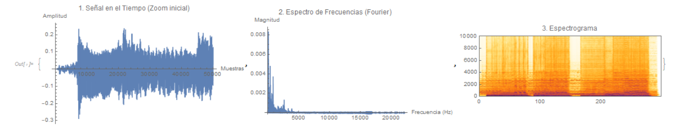

# 🎵 Mathematical Audio Processing

An exploration of signal processing applied to commercial music, built entirely in **Wolfram Mathematica**.

## Project Goal
The objective of this project was to take a raw audio file (initially with a Radiohead song) and apply mathematical transformations to analyze its frequency, filter noise, and visualize its acoustic properties.

## Features & Methods
* **Waveform Extraction:** Imported and digitized stereo audio signals.
* **Fourier Transforms (FFT):** Converted time-domain signals into the frequency domain.
* **Filtering:** Applied [insert type of filter, e.g., low-pass/high-pass] mathematical filters.
* **Spectrogram Visualization:** Generated heatmaps of frequency intensity over time.

## Visual Preview
*Because audio processing is highly visual, here is a look at the frequency analysis:*

*(To see the full mathematical breakdown, open the `.nb` file included in this folder).*
